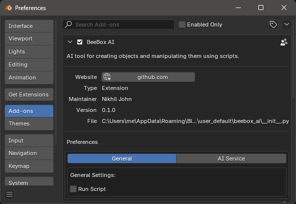
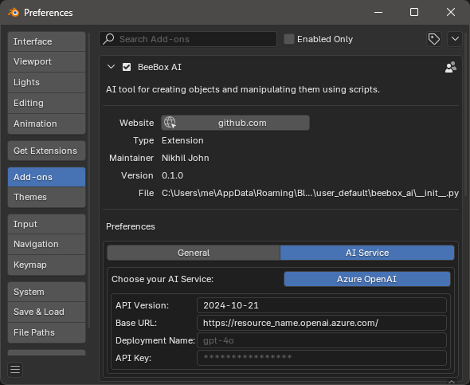
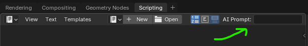

# BeeBox AI

An AI tool for creating 3D models and manipulating them by generating python scripts inside Blender's Script Editor.

### Instruction
First time installation will take couple of minutes as it require to install openai python module. To use AI Service, provide API details in preference. The prompt is available inside Scripting workspace header.

Note: Only support Azure OpenAI as of now.

### Preference

### AI Prompt

## TODO
- Support for OpenAI API ( Nikhil-John/beebox-ai#1 )

## License

[GNU GENERAL PUBLIC LICENSE Version 3, 29 June 2007](LICENSE)
